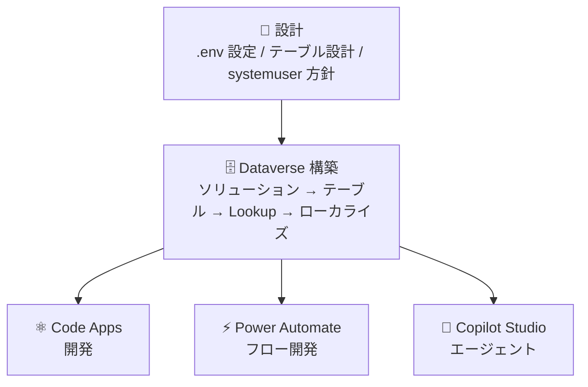

# Power Platform コードファースト開発標準

Power Apps Code Apps・Dataverse・Power Automate・Copilot Studio を VS Code + GitHub Copilot で構築するための開発標準とスターターテンプレートです。

[](https://vscode.dev/github/geekfujiwara/CodeAppsDevelopmentStandard)
[](https://github.com/features/copilot)
[](./LICENSE)

本リポジトリには **開発標準ドキュメント**・**GitHub Copilot カスタムエージェント**・**Code Apps スターターテンプレート**・**Power Automate フロー作成パターン** がすべて含まれています。クローンするだけですぐに開発を開始できます。

> [!NOTE]
> 本リポジトリは [ギークフジワラ](https://twitter.com/geekfujiwara) の実務経験・検証に基づき継続的に更新されています。

---

## スターターテンプレート

本リポジトリには Tailwind CSS + shadcn/ui を採用したスターターテンプレートが含まれており、以下のサンプル実装がすぐに利用できます。


### ギャラリー & フィルター

検索機能付きアイテムギャラリー、複数条件フィルタリング、ページネーション、レスポンシブグリッドレイアウト。


### フォーム

モーダルベースのフォーム、API データを活用した動的フォームフィールド、バリデーションとエラーハンドリング。


### ダッシュボード

統計カード表示、データの集計と可視化、カードベースのレイアウト。


### カンバンボード

タスクをドラッグ & ドロップでステータス間を移動できるカンバンビュー。


### ガントチャート

タスクをドラッグで移動、ハンドルで期間変更できるインタラクティブなガントチャート。


---

## セットアップ

```bash
git clone https://github.com/geekfujiwara/CodeAppsDevelopmentStandard .
npm install
```

VS Code で開くと `.github/agents/` と `.github/skills/` が自動認識され、**GeekPowerCode** エージェントが GitHub Copilot Chat で使えるようになります。

### 既存プロジェクトに開発標準だけ追加する場合

```powershell
$base = "https://raw.githubusercontent.com/geekfujiwara/CodeAppsDevelopmentStandard/main"
@(".github/agents", ".github/skills/power-platform-standard", "docs") | ForEach-Object { New-Item -ItemType Directory -Path $_ -Force }
@(
  @{Src="$base/.github/agents/GeekPowerCode.agent.md"; Dst=".github/agents/GeekPowerCode.agent.md"},
  @{Src="$base/.github/skills/power-platform-standard/SKILL.md"; Dst=".github/skills/power-platform-standard/SKILL.md"},
  @{Src="$base/docs/POWER_PLATFORM_DEVELOPMENT_STANDARD.md"; Dst="docs/POWER_PLATFORM_DEVELOPMENT_STANDARD.md"}
) | ForEach-Object { Invoke-WebRequest -Uri $_.Src -OutFile $_.Dst }
```

---

## GitHub Copilot での活用

推奨モデル: Claude Opus 4.6

### カスタムエージェントモード

VS Code の GitHub Copilot Chat で **@GeekPowerCode** を選択して指示します。

```
@GeekPowerCode インシデント管理アプリを作成してください。
テーブル: Incident, IncidentCategory, Asset, Location
フィールド: タイトル, 説明, ステータス, 優先度, 担当者
```

エージェントは[開発標準](docs/POWER_PLATFORM_DEVELOPMENT_STANDARD.md)に従い、以下を自動で考慮します:

- 英語スキーマ名でテーブル設計
- `createdby` システム列を報告者として活用
- `systemuser` テーブルへの Lookup でユーザー参照
- 先にデプロイ → Dataverse 接続確立 → 開発の順序

### スキルとして使う

チャットで `/power-platform-standard` と入力すると、開発標準に基づくガイダンスが得られます。

### URL を渡して使う

```
このリポジトリを参照して、IT資産管理アプリを作成してください。
https://github.com/geekfujiwara/CodeAppsDevelopmentStandard
```

> [!NOTE]
> ユーザーからの指示が曖昧な場合、GitHub Copilot は不明点をユーザーに質問して確認しながら実装を進めます。

---

## 目次

- [設計原則](#設計原則)
- [前提条件](#前提条件)
- [開発フロー](#開発フロー)
- [Dataverse 構築](#dataverse-構築)
- [Code Apps 開発](#code-apps-開発)
- [Power Automate フロー開発](#power-automate-フロー開発)
- [Copilot Studio エージェント](#copilot-studio-エージェント)
- [トラブルシューティング](#トラブルシューティング)
- [詳細リファレンス](#詳細リファレンス)

---

## 設計原則

実際の開発で発生した手戻りと失敗から確立された原則です。

| #   | 原則                                | 理由                                                 |
| --- | ----------------------------------- | ---------------------------------------------------- |
| 1   | **スキーマ名は英語のみ**            | `pac code add-data-source` が日本語表示名で失敗する  |
| 2   | **SystemUser を Lookup 先に**       | カスタムユーザーテーブルは不要                       |
| 3   | **作成者は createdby を利用**       | カスタム ReportedBy Lookup は作成→削除の手戻りになる |
| 4   | **Choice 値は 100000000 始まり**    | 0, 1, 2 はカスタム Choice で使用不可                 |
| 5   | **先にデプロイ、後から開発**        | ローカル開発後のデプロイで Dataverse 接続が失敗する  |
| 6   | **テーブル作成はリトライ付き**      | 連続作成で 0x80040237 メタデータロックが発生する     |
| 7   | **PUT + MetadataId でローカライズ** | PATCH/POST では表示名が反映されない                  |
| 8   | **ソリューション内で管理**          | ソリューション外カスタマイズはリリース管理不可       |

> [!NOTE]
> 詳細は [Power Platform コードファースト開発標準](docs/POWER_PLATFORM_DEVELOPMENT_STANDARD.md) を参照してください。

---

## 前提条件

| 項目                | 詳細                                                                                                                                           |
| ------------------- | ---------------------------------------------------------------------------------------------------------------------------------------------- |
| Visual Studio Code  | [Power Platform Tools 拡張機能](https://marketplace.visualstudio.com/items?itemName=microsoft-IsvExpTools.powerplatform-vscode) をインストール |
| GitHub Copilot      | VS Code に GitHub Copilot 拡張機能をインストール（推奨モデル: Claude Opus 4.6）                                                                |
| Node.js             | LTS バージョン v18.x / v20.x                                                                                                                   |
| Python 3.10+        | Dataverse 自動化スクリプト用                                                                                                                   |
| PAC CLI             | 最新バージョン                                                                                                                                 |
| Power Platform 環境 | Code Apps が有効化されていること                                                                                                               |
| ライセンス          | Power Apps Premium                                                                                                                             |

> [!NOTE]
> GitHub Copilot Agent モードと GeekPowerCode エージェントにより、会話形式で Dataverse テーブルの設計・作成・デプロイが可能になります。詳細な注意点は[こちらのブログ記事](https://www.geekfujiwara.com/tech/powerplatform/8082/)を参照してください。

---

## 開発フロー

本標準は以下の構成要素から成り、プロジェクトに応じて必要なものを選択できます。



> [!NOTE]
> Code Apps・Power Automate・Copilot Studio は独立して選択できます。プロジェクトに必要なものだけ組み合わせてください。

### 設計

環境情報は **Power Apps ポータル > 設定（右上の⚙）> セッション詳細** から取得する。

```bash
# .env ファイル
DATAVERSE_URL=https://{org}.crm.dynamics.com/   # セッション詳細の Instance URL
TENANT_ID={your-tenant-id}                       # セッション詳細の Tenant ID
SOLUTION_NAME={solution-name}
PUBLISHER_PREFIX={prefix}
PAC_AUTH_PROFILE={profile-name}
```

**テーブル設計の鉄則**

| ルール                     | 説明                                               |
| -------------------------- | -------------------------------------------------- |
| プレフィックス統一         | パブリッシャープレフィックスを全テーブル・列に統一 |
| 英語スキーマ名             | `geek_asset` ✅ / `geek_設備` ❌                   |
| Lookup → systemuser        | ユーザー参照は SystemUser テーブル                 |
| 作成者は createdby         | 報告者・登録者のカスタム列は作らない               |
| Choice は 100000000 始まり | `100000000=新規, 100000001=対応中`                 |

**テーブル作成順序**: 参照先マスタ → 主テーブル → 従属テーブル → Lookup

---

## Dataverse 構築

### テーブル作成

GitHub Copilot Agent モード（GeekPowerCode エージェント）を使い、VS Code 上で会話形式で行います。

```
「以下の Dataverse テーブルを作成してください。
テーブル名: IT Asset
プレフィックス: cr_
フィールド:
- 資産名 (cr_name): テキスト, 必須
- ステータス (cr_status): 選択肢 (100000000=稼働中, 100000001=修理中, 100000002=廃棄済み)
- 担当者 (cr_assignedto): Lookup → SystemUser」
```

> [!WARNING]
> スキーマ名は必ず英語にしてください。日本語の表示名で `pac code add-data-source` が失敗します。

### メタデータ競合エラー対策

テーブルやリレーションシップを連続作成すると、メタデータロック `0x80040237` が発生します。

```python
def retry_metadata(fn, description, max_attempts=5):
    for attempt in range(max_attempts):
        try:
            return fn()
        except Exception as e:
            err = str(e)
            if "already exists" in err.lower():
                return None
            if "0x80040237" in err or "another" in err.lower():
                time.sleep(10 * (attempt + 1))  # 10s → 20s → 30s
                continue
            raise
    return None
```

### 日本語ローカライズ

表示名の更新は PUT メソッド + MetadataId を使用します。

```python
data = api_get(f"EntityDefinitions(LogicalName='{name}')?$select=MetadataId,...")
body = {
    "@odata.type": "#Microsoft.Dynamics.CRM.EntityMetadata",
    "MetadataId": data["MetadataId"],
    "DisplayName": {"LocalizedLabels": [{"Label": "日本語名", "LanguageCode": 1041}]},
}
api_put(f"EntityDefinitions({data['MetadataId']})", body)
```

> [!IMPORTANT]
> PATCH では表示名が反映されないケースがあります。GET → PUT パターンを使い、リクエストヘッダーに `MSCRM.MergeLabels: true` を必ず含めてください。

---

## Code Apps 開発

### クイックスタート

```bash
# 1. 依存関係インストール
npm install

# 2. 先にビルド＆デプロイ — Dataverse 接続確立のため
npm run build
npx power-apps push --solution-id {SolutionName}

# 3. Dataverse コネクタ追加
pac code add-data-source -a dataverse -t {table_logical_name}

# 4. 開発 → ビルド → 再デプロイ
npm run dev
npm run build
npx power-apps push --solution-id {SolutionName}
```

> [!IMPORTANT]
> 手順 2 を先に行うことで Power Platform 上にアプリが登録され、Dataverse への接続が有効になります。ローカル開発のみで進めると接続確立時に問題が発生します。

### 技術スタック

| レイヤー          | 技術                     |
| ----------------- | ------------------------ |
| UI フレームワーク | React 18 + TypeScript    |
| スタイリング      | Tailwind CSS + shadcn/ui |
| データフェッチ    | TanStack React Query     |
| ルーティング      | React Router             |
| ビルドツール      | Vite                     |

### DataverseService パターン

```typescript
DataverseService.GetItems(table, query); // OData クエリで一覧取得
DataverseService.GetItem(table, id, query); // 単一レコード取得
DataverseService.PostItem(table, body); // レコード作成
DataverseService.PatchItem(table, id, body); // レコード更新
DataverseService.DeleteItem(table, id); // レコード削除

// Lookup フィールド
await DataverseService.PostItem("geek_incidents", {
  geek_name: "ネットワーク障害",
  "geek_assignedtoid@odata.bind": `/systemusers(${userId})`,
});

// createdby = 報告者として利用
const items = await DataverseService.GetItems(
  "geek_incidents",
  "$select=geek_name&$expand=createdby($select=fullname)",
);
```

### PAC CLI コマンドリファレンス

```bash
# 認証
pac auth create --environment {environment-id}
pac env select --environment {environment-url}

# コネクタ追加
pac connection list
pac code add-data-source -a dataverse -t {table-logical-name}
pac code add-data-source -a {api-name} -c {connection-id}

# デプロイ
npm run build
pac code push
```

### コネクタ一覧

| コネクタ              | API 名                       | 主な用途                   |
| --------------------- | ---------------------------- | -------------------------- |
| Dataverse             | `dataverse`                  | CRUD 操作                  |
| SQL Server            | `shared_sql`                 | CRUD、ストアドプロシージャ |
| SharePoint            | `shared_sharepointonline`    | ドキュメントライブラリ     |
| Office 365 Users      | `shared_office365users`      | ユーザープロフィール       |
| Microsoft Teams       | `shared_teams`               | 通知                       |
| OneDrive for Business | `shared_onedriveforbusiness` | ファイルストレージ         |

### ベストプラクティス

- ローカル開発はポート 3000 を使用
- `tsconfig.json` で `verbatimModuleSyntax: false`
- `vite.config.ts` で `base: "./"`
- PAC CLI 生成の TypeScript モデルとサービスを使用
- コネクタ操作にリトライ付きエラーハンドリング

---

## Power Automate フロー開発

Python スクリプトから Power Automate Management API を使い、クラウドフローをコードファーストで作成・デプロイできます。

> [!NOTE]
> Power Automate は必須ではありません。通知やバックグラウンド処理が不要なプロジェクトではこのセクションをスキップできます。

### 認証

Flow API と PowerApps API でそれぞれ異なるスコープのトークンが必要です。

```python
# フロー管理 API 用
token = get_token(scope="https://service.flow.microsoft.com/.default")

# 接続検索用（PowerApps API）
pa_token = get_token(scope="https://service.powerapps.com/.default")
```

### 環境の解決

`DATAVERSE_URL` から環境 ID を逆引きします。

```python
envs = flow_api_call("GET", "/providers/Microsoft.ProcessSimple/environments")
for env in envs["value"]:
    instance_url = env["properties"]["linkedEnvironmentMetadata"]["instanceUrl"].rstrip("/")
    if instance_url == DATAVERSE_URL:
        ENV_ID = env["name"]
        break
```

### 接続の検索

フローが使用するコネクタの接続は**事前に環境内に作成**しておく必要があります。

```python
CONNECTORS_NEEDED = {
    "shared_commondataserviceforapps": "Dataverse",
    "shared_office365": "Office 365 Outlook",
}
# PowerApps API で接続を検索し、Connected 状態のものを優先使用
```

> [!IMPORTANT]
> 接続が未作成の場合はスクリプトが失敗します。[Power Automate 接続ページ](https://make.powerautomate.com/connections) で事前に作成してください。

### フロー定義の構造

Logic Apps ワークフロー定義スキーマ形式で JSON を組み立て、API でデプロイします。

```python
definition = {
    "$schema": "https://schema.management.azure.com/providers/Microsoft.Logic/schemas/2016-06-01/workflowdefinition.json#",
    "contentVersion": "1.0.0.0",
    "parameters": {
        "$authentication": {"defaultValue": {}, "type": "SecureObject"},
        "$connections": {"defaultValue": {}, "type": "Object"},
    },
    "triggers": { ... },
    "actions": { ... },
}

connection_references = {
    "shared_commondataserviceforapps": {
        "connectionName": dataverse_conn,
        "source": "Invoker",
        "id": "/providers/Microsoft.PowerApps/apis/shared_commondataserviceforapps",
    },
}
```

### デプロイ

```python
flow_payload = {
    "properties": {
        "displayName": "フロー名",
        "definition": definition,
        "connectionReferences": connection_references,
        "state": "Started",
    }
}

# 新規作成
flow_api_call("POST", f"/providers/Microsoft.ProcessSimple/environments/{ENV_ID}/flows", flow_payload)

# 既存更新
flow_api_call("PATCH", f"/providers/Microsoft.ProcessSimple/environments/{ENV_ID}/flows/{flow_id}", flow_payload)
```

### 代表的フローパターン: ステータス変更通知

| ステップ | アクション                | 説明                                     |
| -------- | ------------------------- | ---------------------------------------- |
| トリガー | `SubscribeWebhookTrigger` | Dataverse 行のフィルタ列が変更されたとき |
| 1        | `GetItem`                 | 起票者（createdby → systemuser）を取得   |
| 2        | `Compose`                 | ステータス値を日本語ラベルに変換         |
| 3        | `If`                      | メールアドレスの存在チェック             |
| 4        | `SendEmailV2`             | Office 365 Outlook で通知メール送信      |

### ベストプラクティス

- 既存フローを `displayName` で検索し、あれば更新・なければ新規作成するべき等冪パターンを使う
- API 失敗時はフロー定義 JSON をファイル出力し、手動インポートのフォールバックを用意する
- 接続は `source: "Invoker"` で呼び出し元ユーザーの資格情報を使用する
- Compose アクションで Choice 値 → 日本語ラベルの変換を行う

---

## Copilot Studio エージェント

Copilot Studio エージェントを組み合わせると、自然言語でのデータ操作が可能になります。

> [!NOTE]
> Copilot Studio は必須ではありません。Code Apps + Dataverse だけで完結するプロジェクトではこのセクションをスキップできます。

### 開発方針

| ステップ                          | 方法                             | 備考                                           |
| --------------------------------- | -------------------------------- | ---------------------------------------------- |
| 1. エージェント作成               | Copilot Studio UI                | API（bots INSERT）ではプロビジョニングされない |
| 2. カスタムトピック削除           | Web API で全削除                 | トピックベース開発は非推奨                     |
| 3. 生成オーケストレーション有効化 | `GenerativeActionsEnabled: true` |                                                |
| 4. Instructions 設定              | GPT コンポーネント               | テーブルスキーマ・行動指針・条件分岐           |
| 5. ナレッジ追加                   | Copilot Studio UI で手動         | Dataverse テーブルを追加                       |
| 6. ツール追加                     | Copilot Studio UI で手動         | Dataverse MCP Server を追加                    |
| 7. エージェント公開               | `PvaPublish` アクション          |                                                |

### エージェント作成

```python
bot_id = api_post("bots", {
    "name": "アシスタント名",
    "schemaname": f"{PREFIX}_assistantName",
    "language": 1041,
    "accesscontrolpolicy": 0,
    "authenticationmode": 2,
    "configuration": json.dumps({
        "$kind": "BotConfiguration",
        "publishOnImport": False,
    }),
}, solution=SOLUTION)
```

### 生成オーケストレーション設定

```python
config = {
    "$kind": "BotConfiguration",
    "settings": {"GenerativeActionsEnabled": True},
    "aISettings": {
        "$kind": "AISettings",
        "useModelKnowledge": True,
        "isSemanticSearchEnabled": True,
        "optInUseLatestModels": True,
    },
    "recognizer": {"$kind": "GenerativeAIRecognizer"},
}
api_patch(f"bots({bot_id})", {"configuration": json.dumps(config)})
```

### システムプロンプト設計テンプレート

```yaml
kind: GptComponentMetadata
instructions: |-
  あなたは「{エージェント名}」です。{役割の説明}。

  ## 利用可能なテーブル
  ### {prefix}_incident
  - {prefix}_name: タイトル
  - {prefix}_status: ステータス (100000000=新規, 100000001=対応中, ...)
  - Lookup: {prefix}_assignedtoid → systemuser

  ## 行動指針
  1. ユーザーの意図を正確に理解し、Dataverse 操作を実行
  2. レコード作成時は必須項目を確認してから実行
  3. 日本語で丁寧に応答

  ## 条件分岐
  - データ照会 → ナレッジから検索
  - 新規作成 → MCP Server でレコード作成
  - 更新 → MCP Server で PATCH 操作

conversationStarters:
  - title: レコード検索
    text: "インシデント一覧を見せて"
```

### ナレッジ・ツールの手動追加

以下は Copilot Studio の UI で手動追加します。

1. **ナレッジ**: [Copilot Studio](https://copilotstudio.microsoft.com/) → エージェント → ナレッジ → Dataverse テーブルを追加
2. **ツール**: ツール → コネクタ → Dataverse コネクタ → CRUD アクション有効化

---

## トラブルシューティング

| 問題                              | 原因                   | 解決策                                               |
| --------------------------------- | ---------------------- | ---------------------------------------------------- |
| `pac code add-data-source` 失敗   | テーブル表示名が日本語 | スキーマ名を英語に統一                               |
| `0x80040237` エラー               | メタデータロック競合   | 累進的リトライ                                       |
| ローカライズが反映されない        | PATCH 使用             | PUT + MetadataId に変更                              |
| デプロイ後に Dataverse 接続エラー | 初回デプロイ未実施     | 先にビルド＆プッシュ                                 |
| エージェントが意図通り動かない    | トピックベース設計     | 生成オーケストレーションに切替                       |
| ReportedBy Lookup が不要だった    | `createdby` で代替可能 | 列とリレーションシップを削除                         |
| SDK 初期化エラー                  | 認証期限切れ           | `pac auth create` で再認証                           |
| Flow API トークン取得失敗         | スコープ指定誤り       | `https://service.flow.microsoft.com/.default` を使用 |
| フロー作成時に接続エラー          | 環境内に接続が未作成   | Power Automate 接続ページで事前作成                  |
| フロー環境が見つからない          | DATAVERSE_URL 不一致   | instanceUrl と末尾スラッシュを統一                   |
| ポート 3000 使用中                | 別プロセスが占有       | `taskkill /PID {pid} /F`                             |
| TypeScript ビルドエラー           | `verbatimModuleSyntax` | `tsconfig.json` で `false` に設定                    |

---

## 詳細リファレンス

| ドキュメント                                                                                     | 内容                                                                |
| ------------------------------------------------------------------------------------------------ | ------------------------------------------------------------------- |
| **[docs/POWER_PLATFORM_DEVELOPMENT_STANDARD.md](./docs/POWER_PLATFORM_DEVELOPMENT_STANDARD.md)** | コードファースト開発標準 — 設計原則・全フェーズ詳細・チェックリスト |
| [docs/DATAVERSE_GUIDE.md](./docs/DATAVERSE_GUIDE.md)                                             | Dataverse 統合ガイド                                                |
| [docs/CONNECTOR_REFERENCE.md](./docs/CONNECTOR_REFERENCE.md)                                     | コネクタ設定リファレンス                                            |
| [docs/ADVANCED_PATTERNS.md](./docs/ADVANCED_PATTERNS.md)                                         | 高度な実装パターン                                                  |

### 公式ドキュメント

- [Power Apps Code Apps](https://learn.microsoft.com/ja-jp/power-apps/developer/code-apps/)
- [Power Automate クラウドフロー](https://learn.microsoft.com/ja-jp/power-automate/overview-cloud)
- [Power Automate Management API](https://learn.microsoft.com/ja-jp/power-automate/web-api)
- [Copilot Studio](https://learn.microsoft.com/ja-jp/microsoft-copilot-studio/)
- [Dataverse Web API](https://learn.microsoft.com/ja-jp/power-apps/developer/data-platform/webapi/overview)
- [Power Platform CLI](https://learn.microsoft.com/ja-jp/power-platform/developer/cli/introduction)
- [開発標準 検証記事](https://www.geekfujiwara.com/tech/powerplatform/8082/)

---

## リポジトリ構造

```
.
├── .github/
│   ├── agents/
│   │   └── GeekPowerCode.agent.md           # GitHub Copilot カスタムエージェント
│   └── skills/
│       ├── power-platform-standard/     # 共通基盤スキル
│       ├── code-apps-dev/               # Code Apps 開発スキル
│       ├── code-apps-design/            # CodeAppsStarter デザインスキル
│       ├── power-automate-flow/         # Power Automate フロースキル
│       └── copilot-studio-agent/        # Copilot Studio スキル
├── docs/
│   ├── POWER_PLATFORM_DEVELOPMENT_STANDARD.md
│   ├── DATAVERSE_GUIDE.md
│   ├── CONNECTOR_REFERENCE.md
│   └── ADVANCED_PATTERNS.md
├── src/                                     # Code Apps スターターテンプレート
│   ├── components/                          #   UI コンポーネント + shadcn/ui
│   ├── pages/                               #   ページコンポーネント
│   ├── providers/                           #   React Context Providers
│   ├── hooks/                               #   カスタムフック
│   └── lib/                                 #   ユーティリティ
├── plugins/
│   └── plugin-power-apps.ts                 # Power Apps Vite プラグイン
├── styles/
│   └── index.pcss                           # Tailwind CSS スタイル
├── public/                                  # 静的アセット
├── package.json
├── vite.config.ts
└── README.md
```

---

## 制限事項

| 制限事項                            | 詳細                                       |
| ----------------------------------- | ------------------------------------------ |
| Content Security Policy             | 未サポート                                 |
| ストレージ SAS IP 制限              | 未サポート                                 |
| Power Platform Git 統合             | 未サポート                                 |
| Power Automate 接続の自動作成       | API では不可、環境 UI で事前作成が必要     |
| Copilot Studio エージェント新規作成 | API では不可、Copilot Studio UI で手動作成 |
| ナレッジ・MCP Server 追加           | Copilot Studio UI で手動追加               |

---

## ライセンス

MIT License - 詳細は [LICENSE](./LICENSE) を参照してください。

- 商用利用、転用・改変、再配布、私用が可能
- サポートや保証は提供されません

## フィードバック

- 問題報告: [GitHub Issues](https://github.com/geekfujiwara/CodeAppsDevelopmentStandard/issues)
- X: [@geekfujiwara](https://twitter.com/geekfujiwara)
